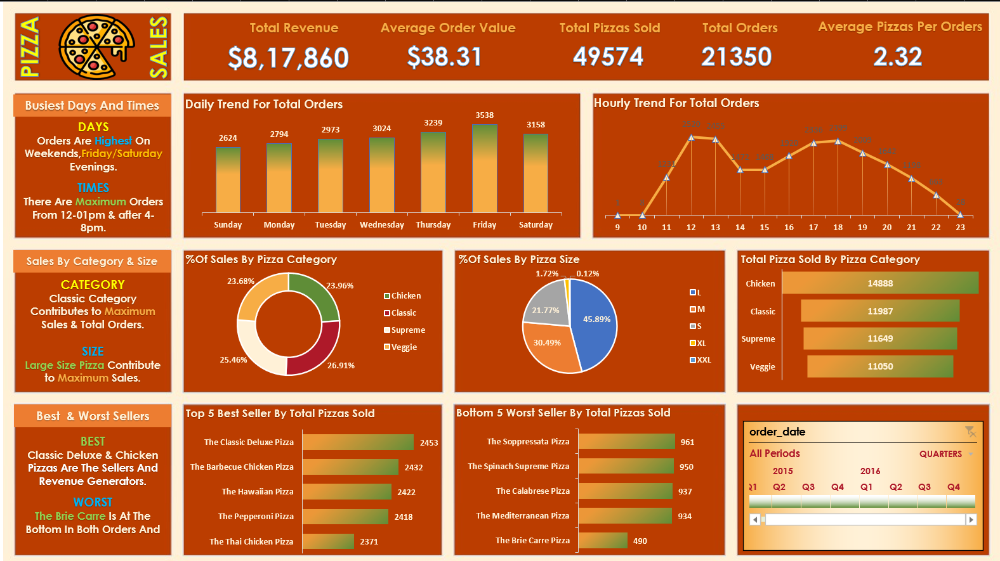

# 🍕 Pizza Sales Dashboard

## 📊 Project Overview
This **Pizza Sales Dashboard** is a comprehensive data analytics project designed to track, analyze, and visualize pizza sales data. The project leverages **SQL** for data extraction and transformation, while **Microsoft Excel** is used for creating dynamic dashboards.

## 🚀 Key Features
- **KPIs:** Total Revenue, Average Order Value, Total Orders, Total Pizzas Sold, Average Pizzas Per Order
- **Trend Analysis:** Daily and Hourly Sales Trends
- **Sales Distribution:** Percentage of Sales by Pizza Category and Size
- **Performance Insights:** Top 5 Best-Selling Pizzas & Bottom 5 Best-Selling Pizzas

## 🛠️ Tech Stack
- **SQL (MySQL):** For data manipulation, aggregation, and querying
- **Excel:** For data visualization, dashboards, and trend analysis

## 📊 Dashboard Preview


## 🎥 Project Walkthrough GIF
\

## 📈 SQL Queries Highlights
### A. KPI’s
1. **Total Revenue:**  
```sql
SELECT SUM(total_price) AS Total_Revenue FROM pizza_sales;
```
2. **Average Order Value:**  
```sql
SELECT (SUM(total_price) / COUNT(DISTINCT order_id)) AS Avg_order_Value FROM pizza_sales;
```
3. **Total Pizzas Sold:**  
```sql
SELECT SUM(quantity) AS Total_pizza_sold FROM pizza_sales;
```
4. **Total Orders:**  
```sql
SELECT COUNT(DISTINCT order_id) AS Total_Orders FROM pizza_sales;
```
5. **Average Pizzas Per Order:**  
```sql
SELECT CAST(CAST(SUM(quantity) AS DECIMAL(10,2)) / 
CAST(COUNT(DISTINCT order_id) AS DECIMAL(10,2)) AS DECIMAL(10,2)) AS Avg_Pizzas_per_order
FROM pizza_sales;
```

### B. Trend Analysis
- **Daily Trend for Total Orders:**  
```sql
SELECT DAYNAME(order_date) AS order_day, COUNT(DISTINCT order_id) AS total_orders
FROM pizzasales
WHERE order_date IS NOT NULL
GROUP BY DAYOFWEEK(order_date), DAYNAME(order_date)
ORDER BY DAYOFWEEK(order_date);
```

- **Hourly Trend for Orders:**  
```sql
SELECT HOUR(order_time) AS order_hours, COUNT(DISTINCT order_id) AS total_orders
FROM pizzasales
GROUP BY HOUR(order_time);
```

### C. Sales Distribution
- **% of Sales by Pizza Category:**  
```sql
SELECT pizza_category, SUM(total_price) AS Total_Sales, 
SUM(total_price) * 100 / (SELECT SUM(total_price) FROM pizzasales WHERE MONTH(STR_TO_DATE(order_date, '%d-%m-%Y')) = 1) AS PCT
FROM pizzasales
WHERE MONTH(STR_TO_DATE(order_date, '%d-%m-%Y')) = 1
GROUP BY pizza_category;
```

- **% of Sales by Pizza Size:**  
```sql
SELECT pizza_size, CAST(SUM(total_price) AS DECIMAL(10,2)) AS Total_Sales, 
CAST(SUM(total_price) * 100 / (SELECT SUM(total_price) FROM pizzasales WHERE QUARTER(STR_TO_DATE(order_date, '%d-%m-%Y')) = 1) AS DECIMAL(10,2)) AS PCT
FROM pizzasales
WHERE QUARTER(STR_TO_DATE(order_date, '%d-%m-%Y')) = 1
GROUP BY pizza_size
ORDER BY PCT DESC;
```

### D. Sales Performance
- **Top 5 Best Sellers:**  
```sql
SELECT pizza_name, SUM(quantity) AS Total_Pizzas_Sold
FROM pizzasales
GROUP BY pizza_name
ORDER BY Total_Pizzas_Sold DESC
LIMIT 5;
```

- **Bottom 5 Best Sellers:**  
```sql
SELECT pizza_name, SUM(quantity) AS Total_Pizzas_Sold
FROM pizzasales
GROUP BY pizza_name
ORDER BY Total_Pizzas_Sold ASC
LIMIT 5;
```

## 📦 Folder Structure
```
├── SQL_Queries.docx          # Contains all SQL queries
├── Dashboard.xlsx            # Excel dashboard with visualizations
├── dashboard.png             # Dashboard image (add this image)
├── video.gif                 # Project walkthrough video
└── README.md                 # Project documentation
```

## 🔗 Check Out the Project
[GitHub Repository](https://github.com/sonikirtan110/Pizza-Sales-Dashboard-/tree/main)

## 🔍 Keywords for Visibility
**#DataAnalytics #SQL #Excel #MySQL #Dashboard #PizzaSales #BusinessInsights #DataVisualization #PortfolioProject #ExcelDashboard #SQLQueries #DataAnalysis**

## 🤝 Connect with Me
If you found this project insightful, feel free to connect with me on [LinkedIn](https://www.linkedin.com/in/kirtansoni02) to discuss more about data analytics and visualization projects.

---  
**#DataAnalytics #SQL #Excel #Dashboard #PizzaSales #BusinessInsights**

